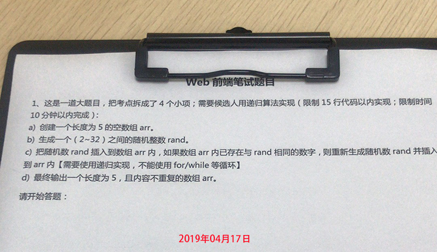

# 前端面试每日三题（每日三问）

> 《论语》，曾子曰：**“吾日三省吾身**。  
> 前端面试每日三题，以面试题来驱动学习，每天进步一点！  
> 让努力成为一种习惯，让奋斗成为一种享受！

## 起源于一道面试题

## 今日面试题 (2019.04.21 周日) —— 第5天
1. [html] [简述超链接target属性的取值和作用](https://github.com/haizhilin2013/interview/issues/13)
2. [css] [CSS3新增伪类有哪些并简要描述](https://github.com/haizhilin2013/interview/issues/14)
3. [js] [写一个把字符串大小写切换的方法](https://github.com/haizhilin2013/interview/issues/15)

### 类库面试专题（敬请期待）
- [jQuery](lib/jQuery.md)
- [Vue](lib/Vue.md)
- [React](lib/React.md)
- [AngularJs](lib/AngularJs.md)

## 历史面试题
- 第4天 (2019.04.20)
    - [html] [HTML5的文件离线储存怎么使用，工作原理是什么？](https://github.com/haizhilin2013/interview/issues/10)
    - [css] [CSS选择器有哪些？哪些属性可以继承？](https://github.com/haizhilin2013/interview/issues/11)
    - [js] [写一个方法把下划线命名转成大驼峰命名](https://github.com/haizhilin2013/interview/issues/12)

- 第3天 (2019.04.19)
    - [html] [HTML全局属性(global attribute)有哪些（包含H5）？](https://github.com/haizhilin2013/interview/issues/7)
    - [css] [在页面上隐藏元素的方法有哪些？](https://github.com/haizhilin2013/interview/issues/8)
    - [js] [去除字符串中最后一个指定的字符](https://github.com/haizhilin2013/interview/issues/9)

- 第2天 (2019.04.18)
    - [html] [html的元素有哪些（包含H5）？](https://github.com/haizhilin2013/interview/issues/4)
    - [css] [CSS3有哪些新增的特性？](https://github.com/haizhilin2013/interview/issues/5)
    - [js] [写一个方法去掉字符串中的空格](https://github.com/haizhilin2013/interview/issues/6)

- 第1天 (2019.04.17)
    - [html] [页面导入样式时，使用link和@import有什么区别？](https://github.com/haizhilin2013/interview/issues/1)
    - [css] [圣杯布局和双飞翼布局的理解和区别，并用代码实现](https://github.com/haizhilin2013/interview/issues/2)
    - [js] [用递归算法实现，数组长度为5且元素的随机数在2-32间不重复的值](https://github.com/haizhilin2013/interview/issues/3)

